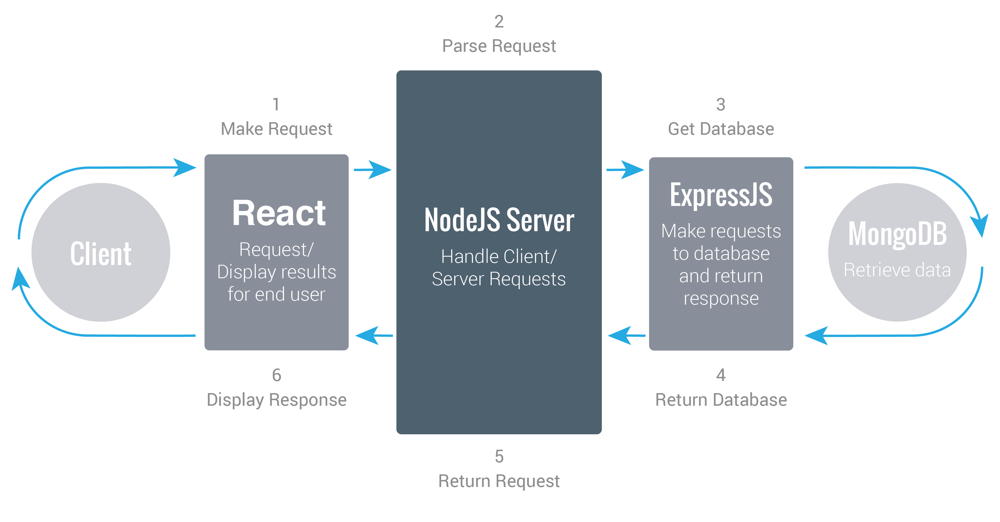

# MINDSET: A Maneira de Pensar

Quando estamos criando aplicações modernas, usamos uma certa maneira de pensar. Estamos falando do modelo cliente-servidor.

Vamos pensar nossa aplicação em duas partes distintas que lidam com tarefas específicas. Os provedores de recursos ou serviços (backend/server-side/Node) que irão lidar com a camada de dados e prover informações para as requisições (frontend/client-side/React).

## Modelo Cliente-Servidor

O Modelo Cliente-Servidor, é uma arquitetura onde um programa, o cliente, faz requisições aos serviços de outro programa, o servidor. Eles podem estar na mesma máquina ou se comunicar por uma rede, no nosso caso.

Existem muitos benefícios em pensar a sua aplicação em duas partes distintas. Nosso servidor sendo uma entidade com uma API na qual podemos acessar todos os nossos dados, isso pode ser escalado facilmente.

Esse pensamento não deve ser exclusivo para esse DevStack JavaScript. Inúmeras aplicações podem se beneficiar desse tipo de arquitetura. Tendo o código _server-side_ separado, podemos criar várias aplicações _front-end_ como websites, aplicações Android, iPhone e Windows, todos se conectado no mesmo dado.

Podemos iterar sobre nosso código _server-side_ e isso não afeta o _fornt-end_. Temos grandes empresas como Google, Facebook, Twitter e GitHub fazendo isso. Eles criam uma API e os clintes _front-end_ (sites, aplicativos móveis e aplicativos de terceiros) integram com eles.

> NOTA: A prática de consumir sua própria API é chamada de [dogfooding](https://en.wikipedia.org/wiki/Eating_your_own_dog_food).

Essas são as partes da sua aplicação separada em cliente e servidor e um gráfico que se tornou muito popular na insternet que exemplifica bem o assunto:

| Componentes Server-side | Componente Client/Frontend |
| -- | -- |
| Server/API (Node e Express) | Frontend Layer (React) |
| Database (MongoDB)|  |
