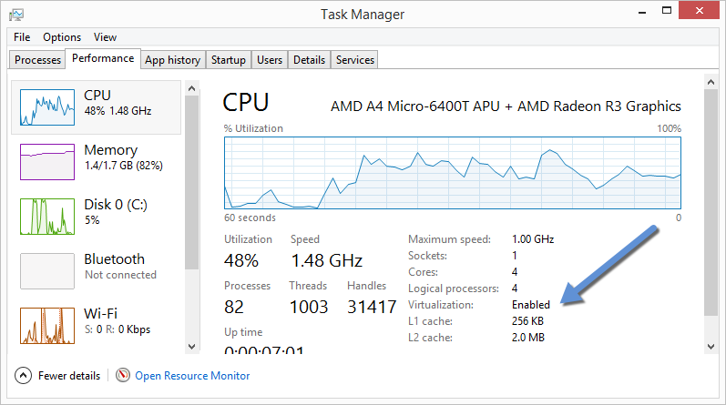
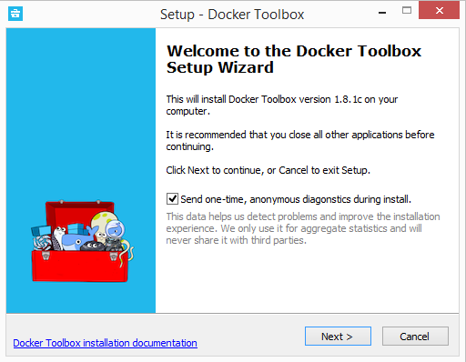
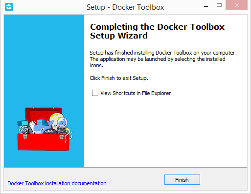

# Instalação

O Docker deixou de ser apenas um software para virar um conjunto deles: um ecossistema.

Nesse ecossistema temos os seguintes softwares:

* **Docker Engine:** É o software base de toda solução. É tanto o daemon responsável pelos containers como o cliente usado para enviar comandos para o daemon.
* **Docker Compose:** É a ferramenta responsável pela definição e execução de múltiplos containers com base em arquivo de definição.
* **Docker Machine:** é a ferramenta que possibilita criar e manter ambientes docker em máquinas virtuais, ambientes de nuvem e até mesmo em máquina física.

Não citamos o [Swarm](https://docs.docker.com/swarm/overview/) e outras ferramentas por não estarem alinhados com o objetivo desse livro: introdução para desenvolvedores.

## Instalando no GNU/Linux

Explicamos a instalação da forma mais genérica possível, dessa forma você poderá instalar as ferramentas em qualquer distribuição GNU/Linux que esteja usando.

### Docker engine no GNU/Linux

Para instalar o docker engine é simples. Acesse seu terminal preferido do GNU/Linux e torne-se usuário root:

```
su - root
```
ou no caso da utilização de sudo

```
sudo su - root
```

Execute o comando abaixo:

```
wget -qO- https://get.docker.com/ | sh
```
Aconselhamos que leia o script que está sendo executado no seu sistema operacional. Acesse [esse link](https://get.docker.com/) e analise o código assim que tiver tempo para fazê-lo.

Esse procedimento demora um pouco. Após terminar o teste, execute o comando abaixo:

```
docker container run hello-world
```

#### Tratamento de possíveis problemas

Se o acesso a internet da máquina passar por controle de tráfego (aquele que bloqueia o acesso a determinadas páginas) você poderá encontrar problemas no passo do **apt-key**. Caso enfrente esse problema, execute o comando abaixo:

```
wget -qO- https://get.docker.com/gpg | sudo apt-key add -
```

### Docker compose no GNU/Linux

Acesse o seu terminal preferido do GNU/Linux e torne-se usuário root:

```
su - root
```
ou no caso da utilização de sudo

```
sudo su - root
```

Execute o comando abaixo:

```
curl -L https://github.com/docker/compose/releases/download/1.6.2/docker-compose-`uname -s`-`uname -m` > /usr/local/bin/docker-compose
chmod +x /usr/local/bin/docker-compose
```
Para testar, execute o comando abaixo:

```
docker-compose version
```

#### Instalando Docker compose com pip

O [pip](https://en.wikipedia.org/wiki/Pip_(package_manager)) é um gerenciador de pacotes Python e, como o docker-compose, é escrito nessa linguagem, é possível instalá-lo da seguinte forma:

```
pip install docker-compose
```

### Docker machine no GNU/Linux

Instalar o docker machine é simples. Acesse o seu terminal preferido do GNU/Linux e torne-se usuário root:

```
su - root
```
ou no caso da utilização de sudo

```
sudo su - root
```

Execute o comando abaixo:

```
$ curl -L https://github.com/docker/machine/releases/download/v0.7.0/docker-machine-`uname -s`-`uname -m` > /usr/local/bin/docker-machine && \
chmod +x /usr/local/bin/docker-machine
```
Para testar, execute o comando abaixo:

```
docker-machine version
```

Obs.: O exemplo anterior utiliza a versão mais recente no momento desta publicação. Verifique se há alguma versão atualizada consultando a [documentação oficial](https://docs.docker.com/machine/install-machine/).

## Instalando no MacOS

A instalação das ferramentas do Ecossistema Docker no MacOS é realizada através de um único grande pacote chamado **Docker Toolbox**.

Você pode instalar via brew cask com o comando abaixo:

```
brew cask install docker-toolbox
```

Também pode instalar manualmente acessando [a página de download](https://www.docker.com/products/docker-toolbox) do **Docker toolbox** e baixando o instalador correspondente ao MacOS.

Após duplo clique no instalador, verá essa tela:


Apenas clique em **Continue**.


Marque todas as opções e clique **Install**.

Será solicitado seu usuário e senha para liberar a instalação dos softwares. Preencha e continue o processo.

Na próxima tela, será apresentado as ferramentas que podem ser usadas para facilitar sua utilização do Docker no MacOS.


Apenas clique em **Continue**.

Essa é ultima janela que verá no processo de instalação.


Apenas clique em **Close** e finalize a instalação.

Para testar, procure e execute o software **Docker Quickstart Terminal**, pois ele fará todo processo necessário para começar a utilizar o Docker.

Nesse novo terminal execute o seguinte comando para teste:

```
docker container run hello-world
```

## Instalando no Windows

A instalação das ferramentas do Ecossistema Docker no Windows é realizada através de um único grande pacote, que se chama **Docker Toolbox**.

O **Docker Toolbox** funciona apenas em [versões 64bit](https://support.microsoft.com/en-us/kb/827218) do Windows e soemnte para as versões superiores ao Windows 7.

É importante salientar também que é necessário habilitar o suporte de virtualização. Na versão 8 do Windows, é possível verificar através do **Task Manager**. Na aba **Performance** clique em **CPU** para visualizar a janela abaixo:



Para verificar o suporte a virtualização do Windows 7, utilize esse [link](http://www.microsoft.com/en-us/download/details.aspx?id=592) para maiores informações.

### Instalando o Docker Toolbox

Acesse [a página de download](https://www.docker.com/products/docker-toolbox) do **Docker toolbox** e baixe o instalador correspondente ao Windows.

Após duplo clique no instalador, verá essa tela:



Apenas clique em **Next**.



Por fim, clique em **Finish**.

Para testar, procure e execute o software **Docker Quickstart Terminal**, pois ele fará todo processo necessário para começar a utilizar o Docker.

Nesse novo terminal execute o seguinte comando para teste:

```
docker container run hello-world
```
